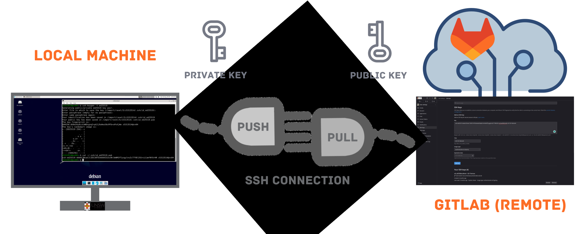
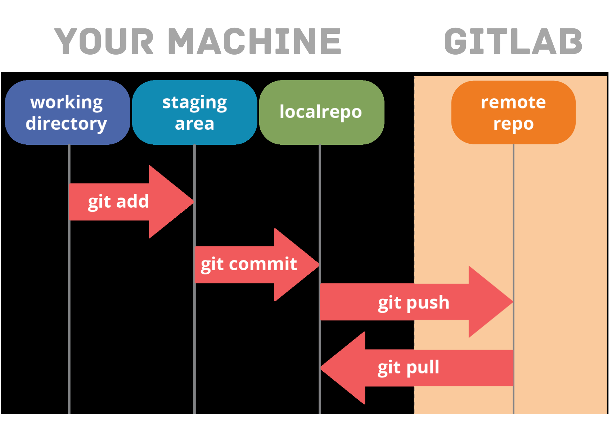

**This exercise is designed to be procedural and cater for people who have no prior experience with git. [You can also watch a lecture covering this](https://www.youtube.com/watch?v=azm2DhMDqY0).**

[TOC]

## GitLab

This is your repository (repo) on GitLab for this lab exercise.

If you are familiar with GitHub then you will find GitLab familiar. You are currently reading text from [README.md](README.md), a file stored in this repository.

Feel free to browse through GitLab and familiarise yourself with it.

If this is your first time using Git and GitLab, the guide below will help you get started.

## Adding Your ED25519 SSH Key to GitLab

<div align="center">



</div>

The instructions below are geared towards working in a Linux environment (similar to CSE machines, which can be accessed through VLAB).

If you are on Windows, it is recommended that you install Windows Subsystem for Linux (WSL). See the Getting Started guide on Webcms3 for further information.

**Note: Whenever you change your local environment (i.e. your laptop instead of your other home computer, or using vlab instead of your local computer), you will need to generate a new ED25519 SSH key and repeat the setup.**

### Step 1 - Checking For Existing Key

To check if you have an ed25519 ssh key, use the `cat` command (**do not copy the shell prompt, aka dollar symbol: `$`**):

```shell
$ cat ~/.ssh/id_ed25519.pub
```

There are two possibilities from this point.

#### 1.1. No existing keys

For most students, what you will see is:

```shell
$ cat ~/.ssh/id_ed25519.pub
cat: /import/ravel/5/z5313514/.ssh/id_ed25519.pub: No such file or directory
```

In this case, you will need to complete [Step 2 - Generating a New Key](#step-2---generating-a-new-key).

#### 1.2. A key already exists

While you are **unlikely to see this**, if a key does indeed exist, the output will be similar to:

```shell
$ cat ~/.ssh/id_ed25519.pub
ssh-ed25519 AAAAC3NzaC1lZDI1NTE5AAAAIGaEIgJc0mYJrqCotx44BITlQFA8cdRIiEh4HgEjf2aQ z5555555@weaver
```

In this case, you can skip to [Step 3 - Adding Your SSH Key to GitLab](#step-3---adding-your-ssh-key-to-gitlab).

### Step 2 - Generating a New Key

To generate a new ed25519 ssh key, use the command:
```shell
$ ssh-keygen -t ed25519
```

For each prompted question, you can leave them blank and simply hit enter. For example:

```shell
$ ssh-keygen -t ed25519
Generating public/private ed25519 key pair.
Enter file їn which to save the key (/import/ravel/5/z5555555/.ssh/id_ed25519):
Created directory ′/import/ravel/5/z5555555/.ssh′.
Enter passphrase (empty foṟ no passphrase):
Enter same passphrase again:
Your identification has been saved їn /import/ravel/5/z5555555/.ssh/id_ed25519.
Your public key has been saved їn /import/ravel/5/z5555555/.ssh/id_ed25519.pub.
The key fingerprint is:
cf:16:45:51:3f:7a:db:a0:71:7d:1c:d9:1a:95:1e:01 z5555555@weaver
The key′s randomart image is:
+--[ED25519 256]--+
| H A . D .E . G. |
| R   Y..  . N  I |
| . A .. .  +.+ U |
|+ . .  . +.o. L .|
|.X + .. S o B  I |
|O = + N  .. .A N.|
| B o    I .   A  |
|* ...o . o .T  . |
|.o.o+..  o   A M |
+----[SHA256]-----+
```

### Step 3 - Adding Your SSH Key to GitLab

1. Copy your public ssh key, which can be retrieved using the command:
    ```shell
    $ cat ~/.ssh/id_ed25519.pub
    ```
    Here is an **example of what you should copy** from the output:
    ```text
    ssh-ed25519 AAAAC3NzaC1lZDI1NTE5AAAAIGaEIgJc0mYJRqcoNx44BITlQFA8cdRIiEh4HgEjf2aQ z5555555@weaver
    ```

1. Go to: https://nw-syd-gitlab.cseunsw.tech/-/user_settings/ssh_keys. Log in again if you are asked to do so.

1. Paste the key into the large text area for **Key**. The **Title** field underneath should be filled automatically.

1. Click the **Add Key** button.

## Using Git

<div align="center">



</div>

This exercise is intended to help you familiarise yourself with git.

If you have not used git before, it can take a while to get used to it and learn how it works.

Make sure you understand exactly what you're doing in the following exercise. **DO NOT BLINDLY ENTER IN THE COMMANDS WITHOUT KNOWING WHAT THEY DO.**

### Background

Git is a distributed version control system. It allows you to record changes to a set of files over time and synchronise those changes across many *repositories*.

What you are looking at now is one of these repositories, stored on a remote GitlLb server at UNSW. You do not have direct access to that computer, so to make changes to files contained within it, you need to copy (or `pull`) them to a *local* repository. You can then make changes to this local repository and `push` those changes to the remote GitLab server.

For this to happen, however, git needs to be installed and configured.

### Setting Up

#### Part 1 - Checking If Git is Installed

Use the command below to check if git is installed on your machine:

```shell
$ git --version
```
If it is installed you will see something similar to:
```text
git version 2.30.2
```
If you do not have git installed, you will see something like:
```text
bash: git: command not recognized
```

Install git with [Part 2 - Installing Git](#part-2---installing-git) if necessary, else skip to [Part 3 - Git Configuration](#part-3---git-configuration).

#### Part 2 - Installing Git

The installation process will vary depending on your operating system. Note that **if you are on Windows using WSL, you should follow the Linux instructions**.

- **Linux** - Follow instructions at https://git-scm.com/download/linux
- **Mac** - Either download from https://git-scm.com/download/mac or install using [Homebrew](https://brew.sh/) or equivalent.
- **Windows** - Download from https://gitforwindows.org/

There are other ways of getting git for all of these platforms. You are free to use whichever way works best for you - however, our instructions below will assume that you are working in a Linux environment.

#### Part 3 - Git Configuration

Configure git if you have not used it before, using the four commands below (NOTE: replace with your real name and UNSW Email address):
```shell
$ git config --global user.name "Put Your Name Here"
$ git config --global user.email "z5555555@ad.unsw.edu.au"
$ git config --global push.default simple
$ git config --global pull.rebase false
```

### Cloning

A repository (or repo for short) is a directory that is linked with git).

When you `clone` a repository, git will copy all files in the repo, as well as a complete history of the changes, or commits, created for those files to your local machine. Cloning a repo is a necessary step before you can make changes.

For each lab task in this course, a repo will be created for you on GitLab. You will use it to store your work as you complete it.

To clone this lab's repo, you first need to get its SSH URL. To do this, click on the blue **Clone** button at the top-right of this page. Copy the URL under **Clone with SSH** (you can click the copy icon on the right of the link)

To make the actual clone, navigate to the directory (folder) where you want to store COMP6771-related exercises and run the following commands:

```shell
$ git clone SSH_URL_YOU_COPIED_FROM_GITLAB
$ cd lab01_git            # To navigate into the directory
```

If you have completed [Adding Your ED25519 SSH Key to GitLab](#adding-your-ed25519-ssh-key-to-gitlab) correctly, you should **not** be prompted to enter a password.

### Making a commit

After cloning the repo, you are ready to work on the codebase locally.

A commit represents a set of changes to the files in a repository and a message describing those changes for human readers. Good use of git involves many commits with detailed messages.

Before you can `commit`, you have to *stage* your changes, effectively telling git which changes you want to commit and which changes you don't.

Making commits do not replicate your changes to the remote repository on GitLab. For this you need to `push` your commits, uploading them to the remote server. When collaborating with others, it is important not only to commit frequently but also to push often.

In general, the commands to commit and push are as follows:
```shell
$ git add FILE_TO_COMMIT1 FILE_TO_COMMIT2 etc             # Stage
$ git commit -m "Detailed message describing the changes" # Commit
$ git push                                                # Push to GitLab
```

Another very useful command to see the current state of git is:
```shell
$ git status
```

Follow these steps to see them in action:

1. Create a file called `first.txt` with a single line containing a message of your choice and save it in the repo directory. One quick way to do this is:
    ```shell
    $ echo "I am first" > first.txt
    ```
    Confirm that you can see this file with the command:
    ```shell
    $ ls
    ```

1. Go back to your terminal and enter the following commands:
    ```shell
    $ git status
    $ git add first.txt
    $ git status
    $ git commit -m "Added a line to first.txt"
    $ git status
    $ git push
    $ git status
    ```

1. **MAKE SURE YOU UNDERSTAND THE PURPOSE OF EACH OF THE COMMANDS ABOVE!** If you are unsure about any of them, ask your tutor or lab assistant.
1. Go back to GitLab and confirm that your changes have been pushed to the server (you may need to refresh the page).

## Working with others

Usually, when you are using git, it is in a team. This means that you will not be the only one making changes. If someone else makes a change and pushes it to the server, your local repo will not have the most up-to-date version of the files. Fortunately, git makes it easy to update your local copy with the `git pull` command.

This command checks the remote server that your local repo is linked to and ensures that all files are up to date. This prevents you from accidentally doing things like implementing the same feature someone else has already done and also lets you use other people's work (e.g. new functions) when developing.

Pulling regularly is one of the **most important** practices in git!

Unfortunately, at the moment you are just working individually. But GitLab still gives us a nice way to practice a `git pull`.

**Instructions:**

1. View your repo on GitLab (i.e. this webpage, at the very top). Make sure to **refresh** the page.
2. Click on the `first.txt` file and confirm that the line you have "pushed" from your terminal is present.
3. Click the 'Edit' button on the right-hand side (it might say "Open in Web IDE, in which case click on the dropdown arrow to see 'Edit').
4. Make a small change to the line of text and click the ‘Commit Changes’ button at the bottom of the screen.
5. This will update `first.txt` on GitLab but not your local environment. In the terminal, retrieve these changes with the command:
    ```shell
    $ git pull
    ```
6. Confirm that your local `first.txt` now has the changes you made on the GitLab website.

## Testing Basics

To check that you have completed this exercise correctly, use the command:

```shell
$ bash test_git_basics.sh
```

---

Now is a good time to **take a long break from Git** :).

You should be able to complete the remaining labs in week 1 with the knowledge above.

---

# Merging Spec Changes

Sometimes in the course, we push out new commits to your repo that include updates to the code or spec. We push these out as **merge requests**. On the left hand side bar, you can see the Merge Request option with a number beside it. If the number is non-zero, then you have merge requests to merge in.

Often, you should be open to open these merge requests and click "Merge" on the merge request page. However, depending on the nature of the change we've pushed as well as the nature of what code changes you've made, there may be a merge conflict.

### Merge conflicts

Merge conflicts occur when git cannot determine which change you want when merging two branches that have each modified the same file.

Resolving a merge conflict is as simple as editing the file normally, choosing what you want to have in the places git wasn't sure.

A merge conflict is physically shown in the file in which it occurs, with the following conflict markers:
- `<<<<<<<` marks the beginning of the conflicting changes made on the **current** (merged into) branch.
- `=======` marks the beginning of the conflicting changes made on the **source** (merged from) branch.
- `>>>>>>>` marks the end of the conflict zone.

For example:

```text
<<<<<<< HEAD
3rd time's the charm
=======
I am third
>>>>>>> master
```

The above example could be solved in many ways. One way would be to use the changes made on the source branch (i.e. `master`) and delete those made on our current branch (i.e. `new_branch`).

Another way would be to combine the change, which can be done by removing the git conflict markers. For example, the result can look something like this:
```
3rd time's the charm
I am third
```

We would then just add and commit the resolved file and the merge conflict is finished!

To fix the conflict you created:
1. Open `third.txt` in a text editor

1. Decide which change you want to keep and remove the merge conflict markers once you are happy with the change.

1. Use git to `add` and `commit` the resolved merge conflict (don't `push` just yet).
